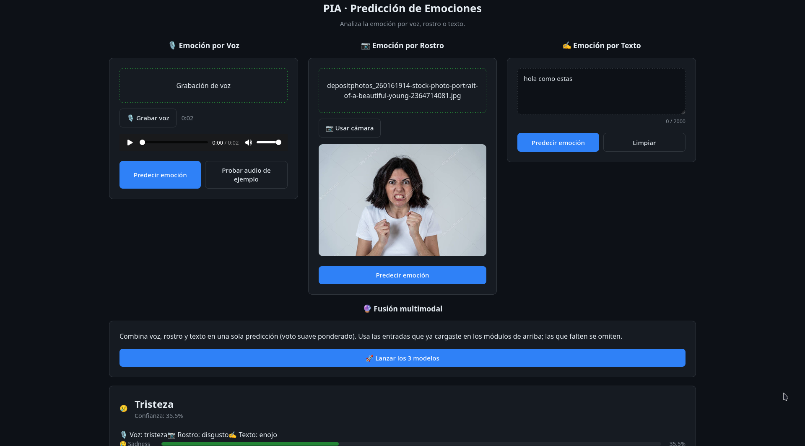

# PIA — Predicción de Emociones (Voz + Rostro + Texto)

Prototipo multimodal que predice la emoción a partir de **voz**, **rostro** o **texto**,
sobre 7 clases: neutral, felicidad, tristeza, enojo, miedo, disgusto y sorpresa.
Incluye una API en FastAPI, un frontend web en vanilla JS con los tres módulos lado a lado,
y una fusión multimodal por voto suave ponderado.



- **Voz:** HuBERT fine-tuned (4 capas descongeladas) + cabeza clasificadora profunda (`models/voz/clasificador_voz_v4.pt`).
- **Rostro:** EfficientNet-B0 fine-tuned + detección facial YuNet (`models/rostro/mejor_modelo_v2.pt`).
- **Texto:** BETO fine-tuned con Focal Loss en EMOEvent (`models/texto/clasificador_texto_v4.pt`).

Los tres módulos viven en el mismo backend y devuelven el mismo formato de respuesta.

---

## Requisitos

- **Python 3.11+**
- ~360 MB de espacio para la caché de HuBERT (módulo de voz, se descarga la 1a vez)
- ~440 MB para la caché de BETO (módulo de texto, se descarga la 1a vez)
- YuNet (~230 KB) se descarga automáticamente la 1a vez (módulo de rostro)
- Un navegador moderno (para el frontend, micrófono y cámara)

---

## Instalacion

### Opcion A (recomendada, Linux/Mac): `install.sh`

Desde la raiz del proyecto:

```bash
./install.sh
```

Este script crea el entorno virtual en `backend/.venv`, instala
`backend/requirements.txt` y descarga automaticamente los 3 modelos (voz, rostro,
texto) desde Hugging Face (ver seccion "Modelos" mas abajo). Al terminar, el proyecto
queda listo para levantar con `./iniciar.sh`.

### Opcion B (recomendada, Windows): `install.ps1`

Desde la raiz del proyecto, en PowerShell:

```powershell
.\install.ps1
```

Hace lo mismo que `install.sh`: crea el entorno virtual en `backend\.venv`, instala
`backend\requirements.txt` y descarga los 3 modelos desde Hugging Face. Al terminar,
el proyecto queda listo para levantar con `.\iniciar.ps1`.

> Si Windows bloquea la ejecucion de scripts `.ps1` (politica de ejecucion por defecto),
> corre una vez en PowerShell, sin permisos de administrador:
> ```powershell
> Set-ExecutionPolicy -Scope CurrentUser -ExecutionPolicy RemoteSigned
> ```

### Opcion C (manual, cualquier sistema operativo)

```bash
cd backend
python -m venv .venv
.venv\Scripts\Activate.ps1   # Windows
# source .venv/bin/activate  # Linux/Mac
pip install -r requirements.txt
```

Con esta opcion, la descarga de los modelos queda pendiente: hacela por separado
siguiendo la seccion "Modelos" de abajo.

## Modelos

Los modelos estan organizados de forma modular: cada modulo tiene su propia carpeta
dentro de `backend/models/`. Estos archivos pesan ~300 MB en total, superan el limite
de 100 MB de GitHub y por eso **no estan en el repositorio** (`backend/models/` esta en
`.gitignore`): se descargan aparte tras clonar. Hay dos formas de conseguirlos.

### Opcion A (recomendada): descarga automatica desde Hugging Face

Cada checkpoint vive en su propio repo de Hugging Face Hub. Con las dependencias ya
instaladas (`huggingface_hub` esta en `requirements.txt`), desde `backend/`:

```bash
# Linux/Mac
.venv/bin/python -m models.descargar_modelos

# Windows
.venv\Scripts\python -m models.descargar_modelos
```

El script (`backend/models/descargar_modelos.py`):
- Revisa cada checkpoint (`voz`, `rostro`, `texto`) y si ya esta en disco no lo vuelve a bajar.
- Si falta, lo descarga mostrando una barra de progreso en pantalla (%, velocidad, ETA) desde:
  - **voz** → `SimuladorDeFarm/NeuroEmoInnovat_modelo_voz`
  - **rostro** → `SimuladorDeFarm/NeuroEmoInnovat_modelo_rostro`
  - **texto** → `SimuladorDeFarm/NeuroEmoInnovat_modelo_texto`
- Si una descarga falla (sin internet, repo no accesible, etc.) **no interrumpe el proceso**:
  avisa con `[ERROR]`, te da el link de descarga manual y la ruta exacta donde debe quedar
  el archivo, y sigue con los demas modulos.

Para solo revisar el estado de los tres sin descargar nada:

```bash
.venv/bin/python -m models.verificar_modelos
```

(Este mismo chequeo corre automaticamente cada vez que arrancas el backend, ver
`main.py` → `lifespan`.)

### Opcion B (alternativa): descarga manual desde Google Drive

Si prefieres no usar Hugging Face, o la descarga automatica de la Opcion A falla para
algun modulo, puedes bajar los archivos a mano.

#### 1. Descargar los modelos

Descarga la carpeta `modelos/` completa desde: **[ENLACE DE DESCARGA AQUI]**

Debe contener exactamente esta estructura:

```
modelos/
├── rostro/
│   ├── face_detection_yunet_2023mar.onnx
│   ├── mejor_modelo_v2.pt
│   └── metadata_v2.json
├── texto/
│   ├── clasificador_texto_v4.json
│   └── clasificador_texto_v4.pt
└── voz/
    ├── clasificador_voz_v4.pt
    └── metadata_voz_v4.json
```

#### 2. Copiar cada archivo a su carpeta dentro de `backend/models/`

El backend espera esta estructura final (nota que `backend/models/` ya trae la
subcarpeta `src/` con el codigo de inferencia; los modelos descargados van **junto** a esa
carpeta, uno por modulo):

```
backend/models/
├── voz/
│   ├── clasificador_voz_v4.pt        ← HuBERT fine-tuned v4 (~362 MB) [requerido]
│   └── metadata_voz_v4.json          ← metadata del entrenamiento (informativo)
├── rostro/
│   ├── mejor_modelo_v2.pt            ← EfficientNet-B0 v2 (~18 MB) [requerido]
│   ├── metadata_v2.json              ← metadata del entrenamiento (informativo)
│   └── face_detection_yunet_2023mar.onnx  ← YuNet [opcional: se descarga solo si falta, ~230 KB]
├── texto/
│   ├── clasificador_texto_v4.pt      ← BETO fine-tuned v4 (~419 MB) [requerido]
│   └── clasificador_texto_v4.json    ← metadata del entrenamiento (informativo)
└── src/                              ← codigo de inferencia (ya viene en el repo)
    ├── inferencia.py                 ← Predictor de voz (HuBERTEmotionModel)
    ├── inferencia_rostro.py          ← PredictorRostro (EfficientNet-B0 + YuNet)
    └── inferencia_texto.py           ← PredictorTexto (BETO)
```

Es decir: copia cada carpeta (`rostro/`, `texto/`, `voz/`) de lo descargado dentro de
`backend/models/`, mezclando con lo que ya existe (no borres `src/`).

```bash
# Desde la raiz del proyecto, con lo descargado en ~/Descargas/modelos/
cp ~/Descargas/modelos/rostro/* backend/models/rostro/
cp ~/Descargas/modelos/texto/*  backend/models/texto/
cp ~/Descargas/modelos/voz/*    backend/models/voz/
```

```powershell
# Windows (PowerShell), con lo descargado en Descargas\modelos\
Copy-Item Descargas\modelos\rostro\* backend\models\rostro\
Copy-Item Descargas\modelos\texto\*  backend\models\texto\
Copy-Item Descargas\modelos\voz\*    backend\models\voz\
```

Los archivos `.json` (`metadata_v2.json`, `metadata_voz_v4.json`, `clasificador_texto_v4.json`)
son metadata del entrenamiento (hiperparametros, metricas, etc.): **no los lee el codigo de
inferencia**, pero se recomienda copiarlos igual para tener el registro completo del modelo.
El unico archivo que se descarga solo si falta es `face_detection_yunet_2023mar.onnx`
(YuNet, detector facial, ~230 KB, ver `backend/models/src/inferencia_rostro.py`).

#### 3. Verificar que las rutas coincidan con el codigo

El backend (`backend/main.py`) carga los checkpoints desde rutas fijas relativas a
`backend/models/`:

```python
CHECKPOINT        = MODELS_DIR / "voz"    / "clasificador_voz_v4.pt"
CHECKPOINT_ROSTRO = MODELS_DIR / "rostro" / "mejor_modelo_v2.pt"
CHECKPOINT_TEXTO  = MODELS_DIR / "texto"  / "clasificador_texto_v4.pt"
```

Si el nombre de archivo no coincide exactamente (mayusculas, version, etc.), ese modulo
no carga y su endpoint responde `503` al arrancar el backend (revisa el log
`[aviso] Módulo de ... no disponible: ...` al iniciar con `uvicorn`).

### Que archivo necesita cada modulo

| Modulo | Checkpoint | Arquitectura | Dataset | F1 test |
|---|---|---|---|---|
| **Voz** | `clasificador_voz_v4.pt` | HuBERT (4 capas descongeladas) + cabeza 768→512→128→7 | RAVDESS | ~0.744 |
| **Rostro** | `mejor_modelo_v2.pt` | EfficientNet-B0 + cabeza 1280→512→128→7 | AffectNet | ~0.640 |
| **Texto** | `clasificador_texto_v4.pt` | BETO (full fine-tune) + clasificacion 7 clases | EMOEvent (es) | ~0.166 |

Cada modulo es **independiente**: si falta un modelo (o sus dependencias), ese modulo queda
deshabilitado y su endpoint responde `503`, pero los demas siguen funcionando.

---

## Uso

### Opcion A (recomendada): backend + frontend juntos con `iniciar.sh`

Desde la raiz del proyecto (Linux/Mac):

```bash
./iniciar.sh
```

Este script levanta el backend (`uvicorn`, puerto 8000) y el frontend (`http.server`,
puerto 5501) en una sola terminal, muestra el estado de cada uno (`[OK]`/`[ERROR]`) y el
link para abrir el frontend. Con `Ctrl+C` detiene ambos de forma segura y libera los
puertos automaticamente.

### Opcion B (recomendada, Windows): backend + frontend juntos con `iniciar.ps1`

Desde la raiz del proyecto, en PowerShell:

```powershell
.\iniciar.ps1
```

Mismo comportamiento que `iniciar.sh`: levanta backend y frontend en una sola consola,
muestra `[OK]`/`[ERROR]` de cada uno y el link del frontend. Con `Ctrl+C` detiene ambos
procesos (y sus hijos) y libera los puertos 8000/5501.

### Opcion C (alternativa): backend y frontend por separado

Util si quieres controlar cada proceso en su propia terminal.

**1. Levantar el backend**

```bash
cd backend
.venv\Scripts\Activate.ps1
python -m uvicorn main:app --reload --host 0.0.0.0 --port 8000
```

Queda disponible en `http://localhost:8000`.

**2. Levantar el frontend**

En otra terminal:

```bash
cd frontend
python -m http.server 5501
```

Abre `http://localhost:5501` en el navegador.

### Desde el frontend puedes:

**Modulo de Voz:**
- Subir un archivo `.wav` y predecir su emocion.
- Grabar tu voz con el microfono (se convierte a WAV en el navegador).

**Modulo de Rostro:**
- Subir una imagen (`.jpg`/`.png`) y predecir la emocion del rostro.
- Usar la camara para capturar una foto y predecir.

**Modulo de Texto:**
- Escribir un texto en espanol y predecir la emocion.

**Fusion Multimodal:**
- Combinar las predicciones de los modulos disponibles mediante voto suave ponderado por F1.

---

## Uso directo de la API

**Voz:**
```bash
curl -X POST http://localhost:8000/predecir -F "audio=@archivo.wav"
```

**Rostro:**
```bash
curl -X POST http://localhost:8000/predecir_rostro -F "imagen=@foto.jpg"
```

**Texto:**
```bash
curl -X POST http://localhost:8000/predecir_texto -H "Content-Type: application/json" -d '{"texto": "Estoy muy feliz hoy"}'
```

**Respuesta (los tres modulos):**

```json
{
  "emocion": "joy",
  "emocion_es": "felicidad",
  "confianza": 0.87,
  "ranking": [["joy", 0.87], ["neutral", 0.06], ["sadness", 0.03], ...]
}
```

---

## Documentacion

- [Docs/modulo_voz.md](Docs/modulo_voz.md) — modulo de voz: arquitectura, dataset, entrenamiento.
- [Docs/modulo_rostro.md](Docs/modulo_rostro.md) — modulo de rostro: EfficientNet-B0 + YuNet.
- [Docs/pipeline_audio.md](Docs/pipeline_audio.md) — preprocesamiento de audio.
- [Docs/pipeline_rostro.md](Docs/pipeline_rostro.md) — pipeline de inferencia de rostro.
- [Docs/pipeline_texto.md](Docs/pipeline_texto.md) — preprocesamiento de texto para BETO.
